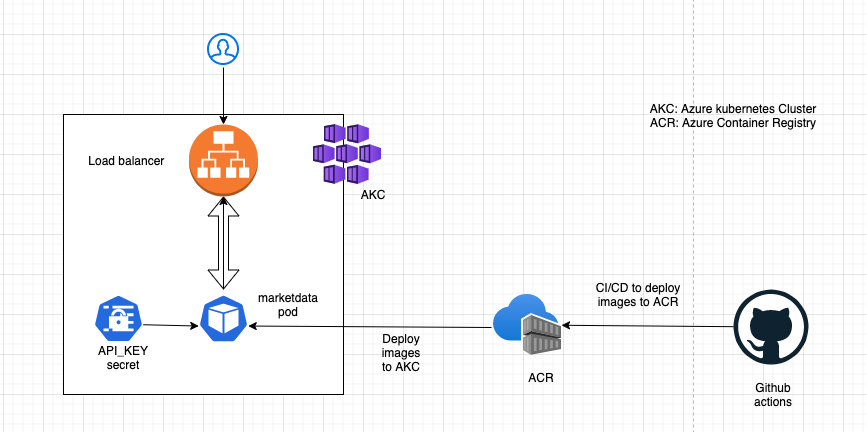
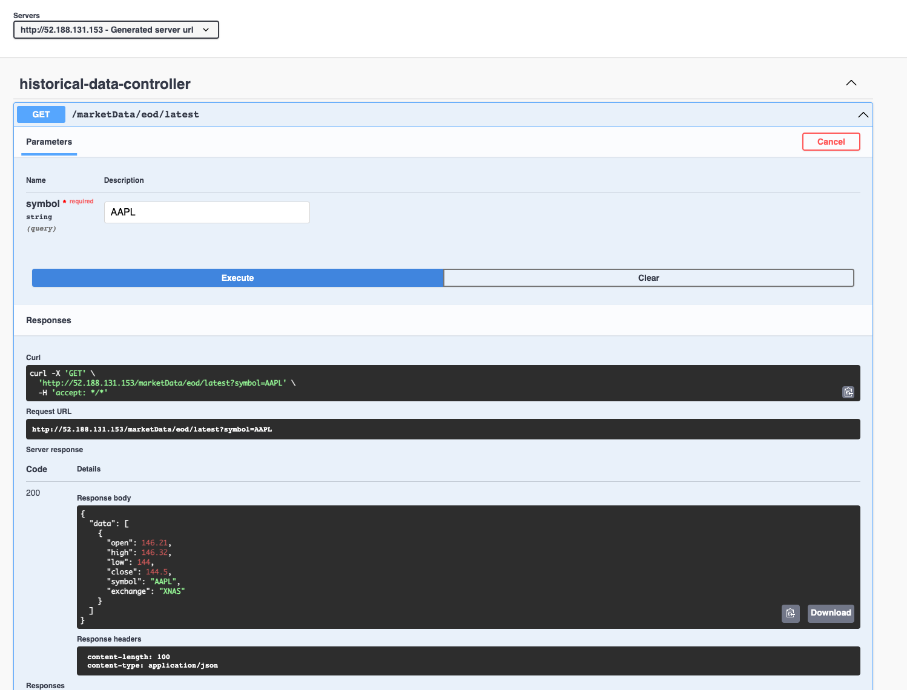

# Deploying containerized applications to Azure Kubernetes Service
A sample application that fetches latest EOD stock data from [Market Stack](https://marketstack.com) to demonstrate CI/CD deployment 
of a containerized application to Azure Kubernetes Service (AKS) and Azure container registry (ACR) via GitHub actions and 
Terraform to manage infrastructure as code. \
Below is a simple architecture of this application. 

#### Azure Resources
<u>Storage Account</u>: Primarily used to store terraform state after each build \
<u>Resource Group</u>: Logical grouping of Azure resources \
<u>Container Registry</u>: Build, store, and manage container images \
<u>Kubernetes Service</u>: Kubernetes on Azure

We have manually created the resource group and storage account to hold our Terraform state generated during pipeline builds via below commands: 
1. Create Resource Group `az group create --location --name <Resource Group name>`
2. Create Storage account `az storage account create -n <storage account name>
   -g <Resource Group name> -l eastus --sku Standard_LRS`
3. Create storage account container `az storage container create -n <storage account container name> --account-name <storage account name>`

#### Terraform Resources
<u>Terraform</u>: Terraform is a tool for building, changing, and versioning infrastructure safely and efficiently.
Terraform has a [registry](https://registry.terraform.io/) that provides plugins that implement the resource types 
required to maintain the Azure infrastructure. We create the container registry and kubernetes cluster via below 
plugins provided by terraform registry: 
1. azurerm_container_registry: to create Azure container registry (ACR)
2. azurerm_kubernetes_cluster: to create Azure Kubernetes cluster (AKS)

#### CI/CD
CI/CD has been implemented using GitHub however, one can use any CI/CD platform. \
The pipeline file can be found at `./.github/workflows/github-ci.yml` \
We need to create a service account, with role contributor, to give our pipeline the ability to 
create and modify Azure resources using the below command: \
`az ad sp create-for-rbac
      --name "<account name>" 
      --sdk-auth --role contributor 
      --scopes /subscriptions/<subscription ID>/resourceGroups/<resource group name>`

<b>Note</b>: Azure has an [issue](https://github.com/Azure/AKS/issues/1517) where the service account cannot update the kubernetes cluster to 
access the container registry. \
`az aks update --name <K8s cluster name> 
         --resource-group <Resource Group name> 
         --attach-acr <Container registry name>` \
Follow the steps in the issue to add API permissions to service principle to fix this issue.

#### Deploying application manually
Please note that when deploying manually, one needs to only create the resource group as opposed to pipeline where 
you need to additionally create storage account and storage account container: 
1. Create Resource Group `az group create --location <region> --name <Resource Group name>`  
2. Build an image `mvn spring-boot:build-image` OR `docker build -t <App name> .`
3. Deploy resources to Azure via terraform  
   `az login` login to Azure with your credentials \
   `cd terraform` \
   `tf init` to initialize terraform \
   `tf plan` to identify any issues with terraform deployment
   `tf apply` to deploy your infrastructure to Azure
4. Deploy the image to Azure container registry 
   1. Login to ACR \
      `az acr login --name <Resource group name>`
   2. Fetch ACR login server name to be used to tag the image \
      `az acr list --resource-group <Resource group name> --query "[].{acrLoginServer:loginServer}" --output table`
   3. TAG image with ACR login server address \
      `docker tag marketdata:0.0.1-SNAPSHOT <ACR login name>/marketdata:latest`
   4. Push image to ACR \
    `docker push <ACR login name>/marketdata:latest`
5. Deploy the image from ACR to AKC \      
   1. Make sure AKC has access to ACR. If not, run the below command \
      `az aks update --name <K8s cluster name> --resource-group <Resource group name> --attach-acr <Container registry name>`
   2. Configure kubelet to talk to your cluster
      `az aks get-credentials --resource-group <Resource group name> --name <K8s cluster name>`
   3. Deploy from ACR to AKC using `kubectl`

#### Application
http://52.188.131.153/swagger-ui.html

